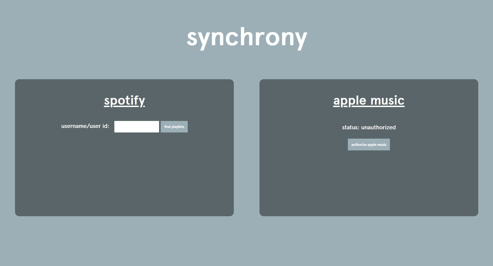

# musicsynchrony

A website to convert Spotify playlists to Apple Music playlists. Development still semi-in progress - contact Tejas Prabhune at prabhune@berkeley.edu for questions/comments/requests for features!

***

## Current Features:

* **Spotify User ID Search** - will return all playlist names for selection from a given Spotify user ID.

* **Authorize Apple Music User** - will authorize any Apple Music subscriber for adding playlists to.

* **Conversion of Spotify playlist to Apple Music playlist** - for an existing blank playlist in Apple Music with the same name as the Spotify account, pushes all songs with similar title to Apple Music.

## Planned Features:

The timeline for planned features is basically nonexistent since this was created for personal use for a temporary Apple Music subscription but since that has almost expired there is no more need for this. If features are wanted, pull requests or requests in general are welcome.

* **Apple Music to Spotify Conversion**

* **Better Query Distance Measurement**

# Code Structure

Not the most maintainable code - the main .js file has been commented to a certain extent but is still very much vanilla JS. API keys are from Spotify and Apple Music developer accounts with format from jwt.to.